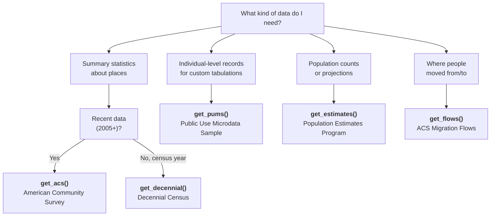

# Census 101: Which Dataset Do I Need?

The Census Bureau publishes dozens of datasets. This page helps you pick the right one for your question and points you to the matching PyPUMS function.

---

## Decision tree



### Summary statistics about places

Use **`get_acs()`** or **`get_decennial()`** when you need pre-tabulated numbers for geographic areas -- states, counties, tracts, ZIP codes, and more.

=== "get_acs() -- American Community Survey"

    Best for most research questions. Covers income, education, housing,
    commuting, health insurance, and hundreds of other topics.

    ```python
    import pypums

    # Median household income by county in Texas
    tx_income = pypums.get_acs(
        geography="county",
        variables="B19013_001",
        state="TX",
        year=2023,
        survey="acs5",
    )
    print(tx_income.head())
    ```

    ```
         GEOID                  NAME      variable  estimate     moe
    0  48001  Anderson County, ...  B19013_001   49318.0  3254.0
    1  48003   Andrews County, ...  B19013_001   85577.0  8921.0
    2  48005  Angelina County, ...  B19013_001   52081.0  2889.0
    3  48007   Aransas County, ...  B19013_001   51364.0  5032.0
    4  48009    Archer County, ...  B19013_001   66563.0  9274.0
    ```

    Published **annually**. Available from 2005 onward.

=== "get_decennial() -- Decennial Census"

    The once-a-decade full count of the US population. Use it for total
    population, race/ethnicity breakdowns, and housing unit counts at very
    fine geographies (down to the block level).

    ```python
    import pypums

    # Total population by state from the 2020 Census
    pop_2020 = pypums.get_decennial(
        geography="state",
        variables="P1_001N",
        year=2020,
    )
    print(pop_2020.head())
    ```

    ```
      GEOID       NAME  variable     value
    0    01    Alabama  P1_001N   5024279
    1    02     Alaska  P1_001N    733391
    2    04    Arizona  P1_001N   7151502
    3    05   Arkansas  P1_001N   3011524
    4    06  California  P1_001N  39538223
    ```

    Available for **2000**, **2010**, and **2020**.

### Individual-level records

Use **`get_pums()`** when you need to create custom cross-tabulations that do not exist in any pre-made table. PUMS gives you one row per person (or household) with dozens of characteristics.

```python
import pypums

# Age, education, and income for New York residents
ny_micro = pypums.get_pums(
    variables=["AGEP", "SCHL", "PINCP"],
    state="NY",
    survey="acs5",
    recode=True,
)
print(ny_micro.head())
```

```
   SERIALNO  SPORDER  PWGTP  ST   PUMA  AGEP SCHL  PINCP            SCHL_label
0  2022...        1     85  36  03701    42   21  78000  Bachelor's degree
1  2022...        2     62  36  03701    39   22  92000     Master's degree
2  2022...        1     45  36  03702    28   19  34000   Some college, ...
3  2022...        1     71  36  03702    55   16  28000   High school diploma
4  2022...        2     38  36  03702    24   21  41000  Bachelor's degree
```

!!! example "When to use PUMS"
    - Median income for women aged 25-34 with a bachelor's degree in Illinois
    - Commute time distribution by race for a specific metro area
    - Any analysis that crosses two or more demographic dimensions

### Population counts and projections

Use **`get_estimates()`** for the Population Estimates Program (PEP), which produces annual population and housing-unit estimates between census years.

```python
import pypums

# State-level population estimates
state_pop = pypums.get_estimates(
    geography="state",
    product="population",
    vintage=2023,
)
print(state_pop.head())
```

```
       GEOID                 NAME     variable      value
0         01              Alabama  POP_2023    5108468
1         02               Alaska  POP_2023     733406
2         04              Arizona  POP_2023    7303398
3         05             Arkansas  POP_2023    3067732
4         06           California  POP_2023   38965193
```

Products available: `"population"`, `"components"` (births, deaths, migration), `"housing"`, and `"characteristics"` (age/sex/race breakdowns).

### Where people moved

Use **`get_flows()`** for county-to-county or metro-to-metro migration flows based on ACS data.

```python
import pypums

# County-level migration flows in California
ca_flows = pypums.get_flows(
    geography="county",
    state="CA",
    year=2019,
)
print(ca_flows.head())
```

```
  GEOID1  GEOID2               FULL1_NAME               FULL2_NAME  MOVEDIN  MOVEDOUT  MOVEDNET  MOVEDIN_MOE  MOVEDOUT_MOE  MOVEDNET_MOE
0  06001   06013  Alameda County, ...      Contra Costa County, ...     8521      7934       587         1122          1054          1538
1  06001   06075  Alameda County, ...  San Francisco County, ...     6210      5830       380          987           923          1352
2  06001   06085  Alameda County, ...    Santa Clara County, ...     4315      3890       425          845           802          1165
3  06001   06081  Alameda County, ...    San Mateo County, ...      2140      1856       284          612           574           839
4  06001   06077  Alameda County, ...  San Joaquin County, ...     1875      2310      -435          573           634           854
```

The output includes `MOVEDIN`, `MOVEDOUT`, and `MOVEDNET` columns with associated margins of error.

---

## ACS 1-year vs. 5-year

The ACS comes in two flavors. Choosing between them is one of the most common decisions in Census data work.

| Feature                     | ACS 1-Year (`survey="acs1"`)                  | ACS 5-Year (`survey="acs5"`)                   |
|-----------------------------|------------------------------------------------|-------------------------------------------------|
| **Time period**             | Single calendar year                           | Rolling 5-year period (e.g., 2019--2023)        |
| **Currency**                | Most current data available                    | Less current (midpoint of the 5-year window)    |
| **Geographic coverage**     | Areas with 65,000+ population **only**         | All geographies, including tracts and block groups |
| **Sample size**             | ~3.5 million addresses                         | ~17.5 million addresses (5x larger)             |
| **Reliability**             | Larger margins of error                        | Smaller margins of error                        |
| **Best for**                | Large cities, states, year-over-year trends    | Small areas, rural counties, precise estimates  |

!!! tip "Rule of thumb"
    Use **5-year** unless you specifically need the most recent single-year
    snapshot for a large geography. If you are working with tracts, block
    groups, or small counties, you **must** use 5-year -- the 1-year survey
    does not cover them.

```python
# 1-year: only works for areas with 65k+ population
la_city = pypums.get_acs(
    geography="place",
    variables="B01001_001",
    state="CA",
    year=2023,
    survey="acs1",  # Los Angeles city qualifies (65k+)
)
print(la_city.head(3))
```

```
     GEOID                          NAME    variable  estimate      moe
0  0600562  Anaheim city, California  B01001_001  350986.0  10321.0
1  0602000  Antioch city, California  B01001_001  115291.0   5642.0
2  0603000  Bakersfield city, Cali...  B01001_001  403455.0  12381.0
```

```python
# 5-year: works for all geographies
la_tracts = pypums.get_acs(
    geography="tract",
    variables="B01001_001",
    state="CA",
    county="037",
    year=2023,
    survey="acs5",  # required for tracts
)
print(f"{len(la_tracts)} tracts in Los Angeles County")
```

```
2495 tracts in Los Angeles County
```

---

## What is a variable code?

Every Census data point has a unique alphanumeric code. For example:

| Code            | Meaning                                        | Dataset       |
|-----------------|------------------------------------------------|---------------|
| `B19013_001`    | Median household income                        | ACS           |
| `B01001_001`    | Total population                               | ACS           |
| `B25077_001`    | Median home value                              | ACS           |
| `B17001_002`    | Population below poverty level                 | ACS           |
| `B25003_002`    | Owner-occupied housing units                   | ACS           |
| `P1_001N`       | Total population                               | Decennial     |
| `H1_001N`       | Total housing units                            | Decennial     |
| `AGEP`          | Age                                            | PUMS          |
| `PINCP`         | Total personal income                          | PUMS          |
| `SEX`           | Sex                                            | PUMS          |

ACS variable codes follow the pattern **`BXXXXX_NNN`** where `B` is the table prefix, `XXXXX` is the table number, and `NNN` is the line number within the table.

!!! question "How do I find the variable I need?"
    Use `load_variables()` to search the full Census variable catalog:

    ```python
    import pypums

    vars_df = pypums.load_variables(year=2023, dataset="acs5", cache=True)

    # Search for income-related variables
    income_vars = vars_df[
        vars_df["concept"].str.contains("MEDIAN HOUSEHOLD INCOME", case=False, na=False)
    ]
    print(income_vars[["name", "label"]].head(10))
    ```

    ```
               name                                              label
    0   B19013_001      Estimate!!Median household income in the ...
    1   B19013A_001     Estimate!!Median household income in the ...
    2   B19013B_001     Estimate!!Median household income in the ...
    3   B19013C_001     Estimate!!Median household income in the ...
    4   B19013D_001     Estimate!!Median household income in the ...
    5   B19013E_001     Estimate!!Median household income in the ...
    6   B19013F_001     Estimate!!Median household income in the ...
    7   B19013G_001     Estimate!!Median household income in the ...
    8   B19013H_001     Estimate!!Median household income in the ...
    9   B19013I_001     Estimate!!Median household income in the ...
    ```

    The result is a DataFrame with `name`, `label`, and `concept` columns that
    you can filter and search freely.

    See the [Finding Variables guide](../guides/variables.md) for detailed search strategies.

---

## What is a FIPS code?

FIPS (Federal Information Processing Standards) codes are numeric identifiers the Census Bureau assigns to every geographic entity. They are hierarchical:

| Level               | Code length | Example           | Meaning                  |
|---------------------|-------------|-------------------|--------------------------|
| **State**           | 2 digits    | `06`              | California               |
| **County**          | 5 digits    | `06037`           | Los Angeles County, CA   |
| **Tract**           | 11 digits   | `06037264000`     | A tract in LA County     |
| **Block group**     | 12 digits   | `060372640001`    | A block group in that tract |

The `GEOID` column in PyPUMS output is built from these FIPS codes concatenated together.

In PyPUMS, you can pass FIPS codes or human-readable names for the `state` parameter:

```python
# All equivalent:
pypums.get_acs(geography="county", variables="B01001_001", state="06")
pypums.get_acs(geography="county", variables="B01001_001", state="CA")
pypums.get_acs(geography="county", variables="B01001_001", state="California")
```

!!! question "How do I look up a FIPS code?"
    Use `lookup_fips()` to find codes by name:

    ```python
    from pypums.datasets.fips import lookup_fips

    # State FIPS
    lookup_fips(state="California")         # Returns "06"

    # County FIPS (state + county)
    lookup_fips(
        state="California",
        county="Los Angeles County",
    )                                        # Returns "06037"
    ```

    See the [Geography & FIPS Codes guide](../guides/geography.md) for the
    full lookup reference.

---

## What is a geography level?

The Census Bureau organizes the country into a hierarchy of geographic units. Larger units contain smaller ones:

```
Nation
  Region (4)
    Division (9)
      State (50 + DC)
        County (~3,200)
          County Subdivision
            Tract (~85,000)
              Block Group (~240,000)
                Block (~11 million)
```

In addition to this hierarchy, the Census defines statistical and administrative areas that cut across it:

| Geography                            | `geography=` value                         | Typical use                             |
|--------------------------------------|--------------------------------------------|-----------------------------------------|
| State                                | `"state"`                                  | State-level comparisons                 |
| County                               | `"county"`                                 | County-level analysis                   |
| Census tract                         | `"tract"`                                  | Neighborhood-level mapping              |
| Block group                          | `"block group"`                            | Fine-grained demographics               |
| Place (city/town)                    | `"place"`                                  | City-level data                         |
| ZIP Code Tabulation Area             | `"zip code tabulation area"`               | ZIP-code-like analysis                  |
| Congressional district               | `"congressional district"`                 | Legislative district profiles           |
| Metropolitan/Micropolitan area       | `"metropolitan statistical area/micropolitan statistical area"` | Metro area analysis |
| Public Use Microdata Area (PUMA)     | `"public use microdata area"`              | PUMS geography (100k+ people each)      |
| School district                      | `"school district (unified)"`              | Education research                      |

!!! note "State is often required"
    For sub-state geographies (tract, block group, place, county subdivision),
    you must pass a `state` parameter. For tract and block group queries, you
    may also need to specify `county` to narrow the request.

    ```python
    # Tracts in Harris County, Texas
    pypums.get_acs(
        geography="tract",
        variables="B01001_001",
        state="TX",
        county="201",     # Harris County FIPS
    )
    ```

---

## Next steps

Now that you understand the landscape, dive into the data:

- [Quick Start](quickstart.md) -- three runnable examples
- [ACS Data](../guides/acs-data.md) -- detailed guide for `get_acs()`
- [PUMS Microdata](../guides/pums-microdata.md) -- custom tabulations with `get_pums()`
- [Finding Variables](../guides/variables.md) -- search the Census variable catalog
- [Geography & FIPS Codes](../guides/geography.md) -- geographic hierarchies and lookups
- [Margins of Error](../guides/margins-of-error.md) -- working with uncertainty in Census data
