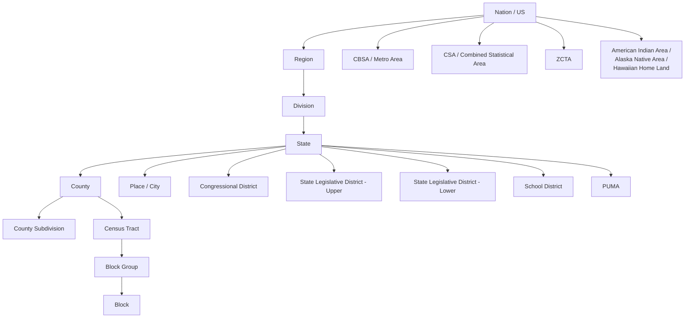

# Geography & FIPS Codes

Every Census API request requires a **geography** --- the level of
aggregation at which data is returned. PyPUMS supports the full range of
Census geographies, from the entire nation down to individual census blocks.

This guide covers the geography hierarchy, how FIPS codes work, and how
to use PyPUMS lookup utilities to translate between names and codes.

## The geography hierarchy

Census geographies form a nested hierarchy. Most levels nest within states,
but some (like metro areas and ZCTAs) cross state boundaries.



!!! info "Not everything nests neatly"

    Some geographies **do not** nest within others:

    - **Places** (cities, towns) can span multiple counties. Los Angeles city
      is mostly in Los Angeles County, but geographic boundaries do not align
      perfectly with county lines.
    - **ZCTAs** (ZIP Code Tabulation Areas) can cross state and county boundaries.
    - **CBSAs** (metro areas) are multi-county regions that often span state lines.

## All valid geography strings

The `geography` parameter in `get_acs()`, `get_decennial()`, and other
functions accepts these strings:

| Geography string | Level |
|---|---|
| `"us"` | Entire United States |
| `"region"` | Census Region (4 regions) |
| `"division"` | Census Division (9 divisions) |
| `"state"` | State (50 states + DC + territories) |
| `"county"` | County or equivalent |
| `"county subdivision"` | County subdivision (towns, townships) |
| `"tract"` | Census tract |
| `"block group"` | Block group |
| `"block"` | Census block |
| `"place"` | Place (city, town, CDP) |
| `"congressional district"` | Congressional district |
| `"state legislative district (upper)"` | State senate district |
| `"state legislative district (lower)"` | State house district |
| `"zcta"` | ZIP Code Tabulation Area |
| `"school district (unified)"` | Unified school district |
| `"school district (elementary)"` | Elementary school district |
| `"school district (secondary)"` | Secondary school district |
| `"cbsa"` | Core Based Statistical Area (metro/micro) |
| `"csa"` | Combined Statistical Area |
| `"puma"` | Public Use Microdata Area |
| `"american indian area/alaska native area/hawaiian home land"` | Tribal and native areas |

## Required parent geographies

Many geographies require you to specify a **parent** geography. For example,
you cannot request tract-level data without specifying which state (and
optionally which county) you want tracts for.

| Geography | Requires `state` | Requires `county` |
|---|---|---|
| `us` | | |
| `region` | | |
| `division` | | |
| `state` | | |
| `county` | :material-check: | |
| `county subdivision` | :material-check: | :material-check: |
| `tract` | :material-check: | :material-check: |
| `block group` | :material-check: | :material-check: |
| `block` | :material-check: | :material-check: |
| `place` | :material-check: | |
| `congressional district` | :material-check: | |
| `state legislative district (upper)` | :material-check: | |
| `state legislative district (lower)` | :material-check: | |
| `zcta` | | |
| `school district (unified)` | :material-check: | |
| `school district (elementary)` | :material-check: | |
| `school district (secondary)` | :material-check: | |
| `cbsa` | | |
| `csa` | | |
| `puma` | :material-check: | |
| `american indian area/...` | | |

!!! warning "County is not always required for tracts"

    When you pass `state` but omit `county` for tract-level requests,
    PyPUMS requests all tracts in the state. This is valid but returns a
    large dataset. To narrow it down, pass both `state` and `county`.

### Examples

=== "No parent required"

    ```python
    from pypums import get_acs

    # All states
    states = get_acs("state", variables="B01003_001", year=2022)

    # All CBSAs (metro areas) nationwide
    metros = get_acs("cbsa", variables="B01003_001", year=2022)

    # All ZCTAs nationwide
    zctas = get_acs("zcta", variables="B01003_001", year=2022)
    ```

=== "State required"

    ```python
    # All counties in California
    counties = get_acs(
        "county",
        variables="B01003_001",
        state="CA",
        year=2022,
    )

    # All places (cities) in Texas
    places = get_acs(
        "place",
        variables="B01003_001",
        state="TX",
        year=2022,
    )
    ```

=== "State + county required"

    ```python
    # All tracts in Los Angeles County, CA
    tracts = get_acs(
        "tract",
        variables="B19013_001",
        state="CA",
        county="037",
        year=2022,
    )

    # All block groups in Cook County, IL
    bgs = get_acs(
        "block group",
        variables="B01003_001",
        state="IL",
        county="031",
        year=2022,
    )
    ```

## FIPS codes explained

The Federal Information Processing Standards (FIPS) system assigns numeric
codes to every geographic entity. These codes are hierarchical:

### Code structure

| Level | Digits | Example | Meaning |
|---|---|---|---|
| State | 2 | `06` | California |
| County | 3 (within state) | `037` | Los Angeles County |
| Tract | 6 (within county) | `207400` | A specific census tract |
| Block group | 1 (within tract) | `2` | Block group 2 |

Full GEOIDs are built by concatenating these codes:

```
GEOID for a block group in LA County:
0  6  0  3  7  2  0  7  4  0  0  2
└──┘  └────┘  └───────────┘  └──┘
state county  tract           block group

Full GEOID: 060372074002
```

!!! tip "Leading zeros matter"

    FIPS codes are **strings**, not numbers. State `06` is California, but
    if you treat it as an integer, you get `6` and lose the leading zero.
    PyPUMS handles this for you, but be careful when working with FIPS codes
    in pandas --- use `dtype=str` when reading CSV files.

## FIPS lookup functions

PyPUMS provides utility functions to translate between names and FIPS codes.

### `lookup_fips()` --- name to code

```python
from pypums.datasets import lookup_fips

# State name to FIPS code
lookup_fips(state="California")
# "06"

# State + county to full FIPS code
lookup_fips(state="California", county="Los Angeles County")
# "06037"

# Works with any state name
lookup_fips(state="New York")
# "36"

lookup_fips(state="New York", county="Kings County")
# "36047"
```

### `lookup_name()` --- code to name

```python
from pypums.datasets import lookup_name

# FIPS code to state name
lookup_name(state_code="06")
# "California"

# FIPS codes to county name
lookup_name(state_code="06", county_code="037")
# "Los Angeles County, California"

lookup_name(state_code="36", county_code="047")
# "Kings County, New York"
```

### The `fips_codes` DataFrame

For bulk lookups or custom filtering, access the full FIPS codes table
directly:

```python
from pypums.datasets import fips_codes

print(fips_codes.head())
#        state state_code              county county_code
# 0    Alabama         01      Autauga County         001
# 1    Alabama         01      Baldwin County         003
# 2    Alabama         01      Barbour County         005
# ...

# Find all counties in California
ca_counties = fips_codes[fips_codes["state"] == "California"]
print(ca_counties[["county", "county_code"]].head())
```

The DataFrame has four columns:

| Column | Description | Example |
|---|---|---|
| `state` | State name | `"California"` |
| `state_code` | 2-digit state FIPS | `"06"` |
| `county` | County name | `"Los Angeles County"` |
| `county_code` | 3-digit county FIPS | `"037"` |

## State resolution

PyPUMS is flexible about how you specify states. The `state` parameter in
`get_acs()`, `get_flows()`, and other functions accepts any of:

| Format | Example | Resolves to |
|---|---|---|
| Full name | `"California"` | `06` |
| Abbreviation | `"CA"` | `06` |
| FIPS code | `"06"` | `06` |

```python
from pypums import get_acs

# All three are equivalent:
df1 = get_acs("county", variables="B01003_001", state="California", year=2022)
df2 = get_acs("county", variables="B01003_001", state="CA", year=2022)
df3 = get_acs("county", variables="B01003_001", state="06", year=2022)
```

This resolution is handled by `pypums.api.geography._resolve_state_fips()`,
which uses the [python-us](https://github.com/unitedstates/python-us) library
under the hood.

## Common gotchas

!!! warning "Places do not nest within counties"

    A common misconception is that cities (places) fit neatly inside
    counties. In reality, many cities span multiple counties:

    - New York City spans 5 counties (boroughs)
    - Jacksonville, FL is coterminous with Duval County but this is the
      exception, not the rule

    You **cannot** request places within a specific county. The `place`
    geography only requires a `state`:

    ```python
    # Correct: all places in California
    places = get_acs("place", variables="B01003_001", state="CA", year=2022)

    # The county parameter is not used for places
    ```

!!! warning "ZCTA is not ZIP Code"

    ZCTAs (ZIP Code Tabulation Areas) are **approximations** of USPS ZIP
    codes built from census blocks. They do not update as frequently as
    ZIP codes, and some ZIP codes have no corresponding ZCTA. Use ZCTAs
    for analysis, but be aware of the limitations.

!!! info "CBSA vs. MSA"

    The term "Metropolitan Statistical Area" (MSA) is one type of Core
    Based Statistical Area (CBSA). The Census API uses `cbsa` to encompass
    both metropolitan and micropolitan statistical areas. In PyPUMS:

    - `get_acs(..., geography="cbsa")` returns all metro **and** micro areas
    - `get_flows(..., geography="metropolitan statistical area")` uses the
      flows-specific endpoint

## Geography reference by dataset

Not all geographies are available in every dataset:

| Geography | ACS 5-year | ACS 1-year | Decennial | Estimates |
|---|---|---|---|---|
| `us` | Yes | Yes | Yes | Yes |
| `state` | Yes | Yes | Yes | Yes |
| `county` | Yes | Yes | Yes | Yes |
| `tract` | Yes | -- | Yes | -- |
| `block group` | Yes | -- | Yes | -- |
| `block` | -- | -- | Yes | -- |
| `place` | Yes | Yes | Yes | -- |
| `cbsa` | Yes | Yes | Yes | Yes |
| `zcta` | Yes | -- | Yes | -- |
| `puma` | Yes | Yes | -- | -- |

!!! note

    The ACS 1-year survey only covers geographies with populations of
    65,000 or more. If you need data for smaller areas (tracts, block
    groups, small counties), use the ACS 5-year survey.

---

## See Also

- [ACS Data](acs-data.md) — Using geographies with `get_acs()` queries
- [Datasets Reference](../reference/datasets.md) — The `fips_codes` DataFrame for bulk FIPS lookups
